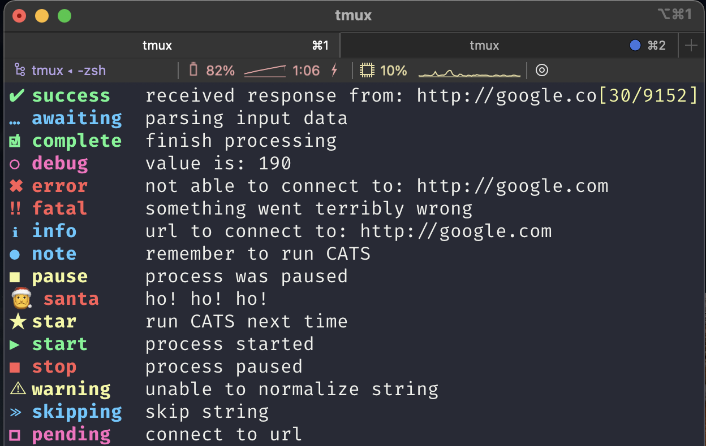
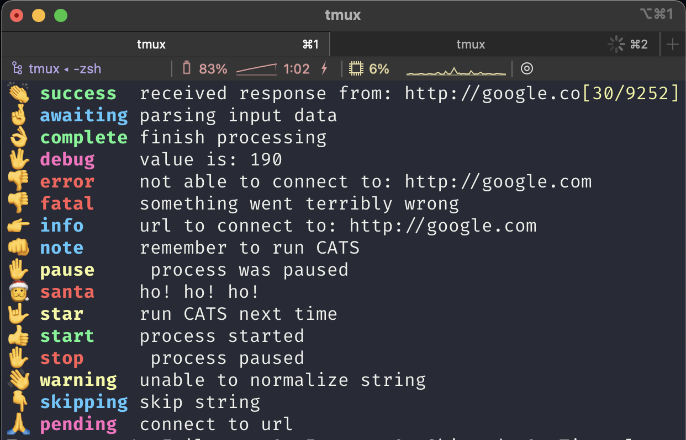
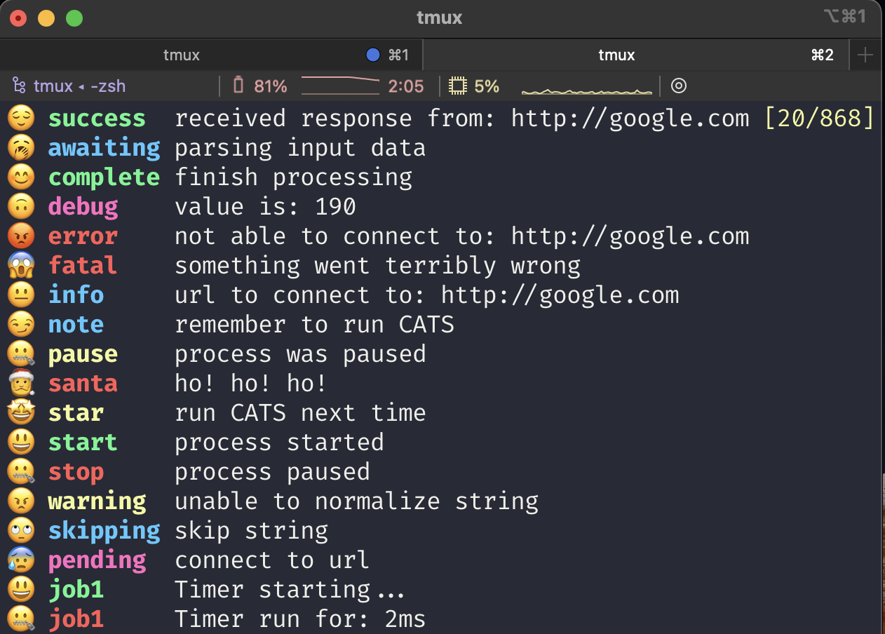

<h1 align="center">
  Pretty Logger for Java (PL4J)
</h1>
<h3 align="center">
  (Now with themes support!)
</h3>
<div align="center">
  
  
  
</div>

# Description

`Pretty Logger for Java` is a [slf4j](http://www.slf4j.org/) decorator that enables pretty printing on the console
using [ANSI formatting](https://en.wikipedia.org/wiki/ANSI_escape_code)
through [jansi](http://fusesource.github.io/jansi/). PL4J is built around the concept
of [Markers](http://www.slf4j.org/faq.html#marker_interface). This means that you must use an 
implementation that supports Markers such as [logback](http://logback.qos.ch/) or [lof4j2](https://logging.apache.org/log4j/2.x/).

Table of Contents
=================

* [Description](#description)
* [Usage](#usage)
* [Configuration](#configuration)
    * [Log Pattern](#log-pattern)
    * [Log Level and Markers](#log-level-and-markers)
    * [Markers Configuration](#markers-configuration)
        * [Individual configuration](#individual-configuration)
        * [Global configuration](#global-configuration)
        * [Default values](#default-values)
    * [Themes](#themes)
    * [Timers](#timers)
* [Projects using PL4J](#projects-using-pl4j)
* [Credits](#credits)

# Usage

Add it as a Maven dependency in your `pom.xml` file:

```xml

<dependency>
    <groupId>io.github.ludovicianul</groupId>
    <artifactId>pretty-logger</artifactId>
    <version>LATEST</version>
</dependency>
```

```java
 public class TestClass {

    public static void main(String... args) {
        PrettyLogger prettyLogger = PrettyLoggerFactory.getLogger(TestClass.class); //same declaration as SLF4J

        prettyLogger.success("received response from: {}", "http://google.com");
        prettyLogger.awaiting("parsing input data");
        prettyLogger.complete("finish processing");
        prettyLogger.debug("value is: {}", "190");
        prettyLogger.error("not able to connect to: {}", "http://google.com");
        prettyLogger.fatal("something went terribly wrong");
        prettyLogger.info("url to connect to: {}", "http://google.com");
        prettyLogger.note("remember to run CATS");
        prettyLogger.pause("process was paused");
        prettyLogger.santa("ho! ho! ho!");
        prettyLogger.star("run CATS next time");
        prettyLogger.start("process started");
        prettyLogger.stop("process paused");
        prettyLogger.warning("unable to normalize string");
    }
}
```

# Configuration

## Log Pattern

This is a sample logback configuration file that was used to display the above console output:

```xml
<?xml version="1.0" encoding="UTF-8"?>
<configuration debug="false">
    <statusListener class="ch.qos.logback.core.status.NopStatusListener"/>
    <appender name="STDOUT" class="ch.qos.logback.core.ConsoleAppender">
        <withJansi>true</withJansi>
        <encoder class="ch.qos.logback.classic.encoder.PatternLayoutEncoder">
            <pattern>%-27marker %msg%n</pattern>
        </encoder>
    </appender>
    <root level="trace">
        <appender-ref ref="STDOUT"/>
    </root>
</configuration>
```

The `pattern` must contain the `%masker` keyword, otherwise no `label` or `symbol` will be displayed.

## Log Level and Markers

PL4J uses the following mapping between the SLF4J log levels and the markers:

| SLF4J Log Level  |  PL4J Marker|
|---|---|
| `debug`  |  `debug` |
| `info`  | `awaiting, complete, info, note, pause, pending, santa, star, start, stop, success, skipping`  |
|  `warn` | `warning`  |
|  `error` |  `error, fatal` |

## Markers Configuration

### Individual configuration

You can override the default Markers as follows:

```java
import io.github.ludovicianul.prettylogger.config.level.PrettyMarker;
import io.github.ludovicianul.prettylogger.PrettyLogger;
import io.github.ludovicianul.prettylogger.config.level.ConfigFactory;

import java.util.HashMap;

public class TestClass {

    public static void main(String... args) {
        PrettyLogger prettyLogger = PrettyLoggerFactory.getLogger(TestClass.class);
        //option 1
        PrettyMarker config = ConfigFactory.error().label("err");// we change the label to `err` instead of `error`
        prettyLogger.log(config, "this is an error");//note that we use log() instead of error()
        //option 2
        Map<PrettyMarker.ConfigKey, Object> configMap = new HashMap<>();
        configMap.put(PrettyMarker.ConfigKey.UNDERLINE, true);
        prettyLogger.skip(configMap, "skip processing for id 1");
    }
}
```

You can override both the `symbol` and the `label`. The following flags can also be configured (all `booleans`):

- `bold`
- `underline`
- `showLabel`
- `showSymbol`

The flags can be configured both individually, for each marker:

```java
import io.github.ludovicianul.prettylogger.config.level.PrettyMarker;
import io.github.ludovicianul.prettylogger.PrettyLogger;
import io.github.ludovicianul.prettylogger.config.level.ConfigFactory;

public class TestClass {

    public static void main(String... args) {
        PrettyLogger prettyLogger = PrettyLoggerFactory.getLogger(TestClass.class);
        PrettyMarker config = ConfigFactory.error().bold(false).underline(true).showLabel(true).showSymbol(true);
        prettyLogger.log(config, "this is an error");//note that we use log() instead of error()
    }
}
```

As well as globally as shown in [Global Configuration](#global-configuration)

### Global configuration

You can configure the above flags globally through a file called `pl4j.properties` which must be present in the
classpath. The following properties can be used to change the flag values (all `booleans`:

- `pl4j.show-labels`
- `pl4j.show-symbols`
- `pl4j.bold`
- `pl4j.underline`
- `pl4j.theme`

### Default values

If no global or individual configuration is supplied the default values are as follows:

- `bold = true`
- `underline = false`
- `showLabel = true`
- `showSymbol = true`
- `theme = default`

## Themes

PL4J supports themes, meaning that you can create your own combination of `symbol`, `label` and `color` for
each `MarkerType`. In order to do this you must create a file named `pl4j-themename.theme` following the example of
the [default theme](https://github.com/ludovicianul/pl4j/blob/master/src/main/resources/pl4j-default.theme), place it
into the classpath and configure the theme name in `pl4j.properties` as follows:

```properties
pl4j.theme=themename
```

If PL4J doesn't find the `pl4j-themename.theme` inside the classpath it will default to the `default` theme. This is the
list of out-of-the-box supported themes:

- default: [https://github.com/ludovicianul/pl4j/blob/master/src/main/resources/pl4j-default.theme](https://github.com/ludovicianul/pl4j/blob/master/src/main/resources/pl4j-default.theme)
- gestures: [https://github.com/ludovicianul/pl4j/blob/master/src/main/resources/pl4j-gestures.theme](https://github.com/ludovicianul/pl4j/blob/master/src/main/resources/pl4j-gestures.theme)
- emojis: [https://github.com/ludovicianul/pl4j/blob/master/src/main/resources/pl4j-emojis.theme](https://github.com/ludovicianul/pl4j/blob/master/src/main/resources/pl4j-emojis.theme)

## Timers
You can also automatically measure the duration of specific tasks using `timers`. This is an example on how to use `timers`:


```java
import io.github.ludovicianul.prettylogger.config.level.PrettyMarker;
import io.github.ludovicianul.prettylogger.PrettyLogger;
import io.github.ludovicianul.prettylogger.config.level.ConfigFactory;

public class TestClass {

    public static void main(String... args) {
        PrettyLogger prettyLogger = PrettyLoggerFactory.getLogger(TestClass.class);
        prettyLogger.time("job1");
        // stuff happening
        prettyLogger.time("job1");
        //other stuff happening
        prettyLogger.timeEnd("job1");
    }
}
```

If you call the `time()` method multiple times using the same timer key, `pl4j` will display interim timers between the starting time, and the moment you call the method again. 
The above program will print something like:

```bash
👍 job1      Timer starting...
✋ job1      Interim timer run for: 2004ms
✋ job1      Timer run for: 4506ms
```

# Projects using PL4J
* [CATS](https://github.com/Endava/cats)

# Credits

Inspired by [signale](https://github.com/klaussinani/signale).
